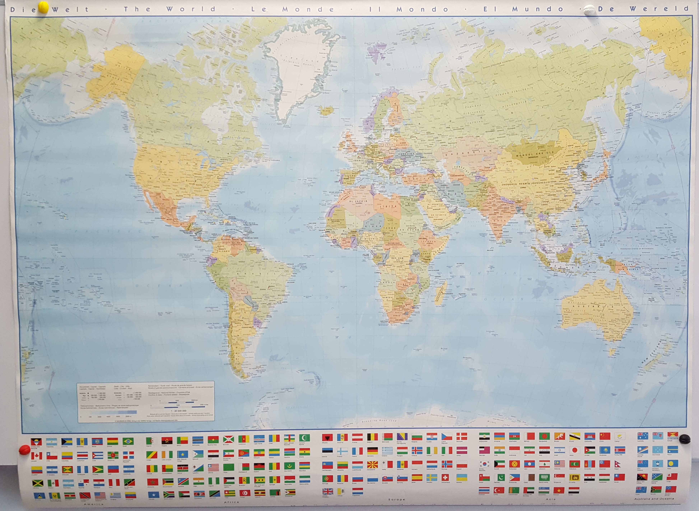
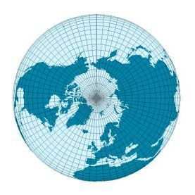
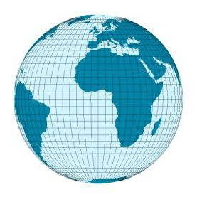
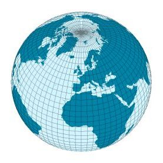

# Kartografie

**Was sind die Probleme mit dieser Karte?**

- Größendarstellung entspricht nicht der Realität (Vergleich Grönland - Afrika)
- Nicht aktuell (siehe [Süd-Sudan](https://de.wikipedia.org/wiki/S%C3%BCdsudan))
- "Unmöglich" zu aktualisieren
- Unhandlich/Platzbedarf
- Zusatzinformationen (Bevölkerungsdichte, Jahresniederschlag, Landessprache)?
- Verteilen/Kopieren der Karte?
- Accessibility? (Rot-Grün-Sehschwäche)

[Größenvergleichstool für Mercator "The True Size"](https://thetruesize.com)

## Projektion

> Ein Kartennetzentwurf (auch Kartenprojektion oder Kartenabbildung genannt) ist eine Methode in der Kartografie, mit der man die gekrümmte Oberfläche der (dreidimensionalen) Erde auf die flache (zweidimensionale) Karte überträgt.

[Wikipedia DE "Kartennetzentwurf"](https://de.wikipedia.org/w/index.php?title=Kartennetzentwurf&oldid=164426786 "Wikipedia EN Kartennetzentwurf")

### Vorgehen

1. Auswahl eines geeigneten Modells für die Form der Erde
2. Umwandlung der geographischen Koordinaten (Länge und Breite) in ein kartesisches Koordinatensystem (x und y oder Rechtswert und Hochwert)
3. Skalierung der Karte

### Abbildungsfläche

- Mathematische Methode der Projektion
- Hilfsfläche als Projektionsleinwand. Dadurch erhält man ein flaches Abbild.
  - Ebene
  - Kegel (ausrollen)
  - Zylinder (ausrollen)

#### [Azimutalprojektion](https://de.wikipedia.org/w/index.php?title=Kartennetzentwurf#Azimutale_Abbildungen)

Azimutalprojektion mit normaler Lage

Azimutalprojektion mit transversaler Lage

Azimutalprojektion mit schiefachsiger Lage

In diesen drei Fällen eine parallel Projektion auf eine flache Leinwand. Es gibt noch einige andere Möglichkeiten bei der Azimutalprojektion die Kugel auf die Fläche zu bekommen.

#### [Kegelprojektion](https://de.wikipedia.org/w/index.php?title=Kartennetzentwurf#Kegelabbildungen_.28konische_Abbildungen.29)

Kegelprojektion

#### [Zylinderprojektion](https://de.wikipedia.org/w/index.php?title=Kartennetzentwurf#Zylinderabbildungen)

World map in Mercator style projection

### Abbildungseigenschaften (Verzerrung)

- längentreue (äquidistante) Abbildung
- flächentreue (äquivalente) Abbildung
- winkeltreue (konforme) Abbildung

**Good to know**: [Tissotsche Indikatrix
](https://de.wikipedia.org/wiki/Tissotsche_Indikatrix)

#### Längentreue Abbildung

Kegelprojektion längentreu

##### [Mittabstandstreue Azimutalprojektion](https://de.wikipedia.org/wiki/Mittabstandstreue_Azimutalprojektion)

Mittabstandstreue polare  Azimutalprojektion

Mittelabstandstreue Azimutalprojektion; Mittelpunkt: Berlin

#### Flächentreue Abbildung

##### [Goode-Projektion](https://de.wikipedia.org/wiki/Goode-Projektion)

Goode-Projektion

Verzerrungen der Goode-Projektion verdeutlicht mit dem [tissotschen Indikatrix](https://de.wikipedia.org/wiki/Tissotsche_Indikatrix)

##### [Sinusoidal-Projektion](https://de.wikipedia.org/wiki/Sinusoidal-Projektion)

Sinusoidal Projection

Sinusoidal-Projektion mit der [tissotschen Indikatrix](https://de.wikipedia.org/wiki/Tissotsche_Indikatrix)

##### [Flächentreue Azimutalprojektion](https://de.wikipedia.org/wiki/Fl%C3%A4chentreue_Azimutalprojektion)

Polare Lambertsche Azimutalprojektion

#### Winkeltreue Abbildung

##### [Mercator-Projektion](https://de.wikipedia.org/wiki/Mercator-Projektion)

World map in Mercator style projection

Winkeltreue Mercatorprojektion (Alle Verzerrungsellipsen sind Kreise)

##### [Lambert-Gaußsche winkeltreue Kegelprojektion](https://de.wikipedia.org/wiki/Lamberts_winkeltreue_Kegelprojektion)

Weltkarte in Lambertscher Kegelprojektion

#### Kompromiss: [Winkel-Tripel-Projektion](https://de.wikipedia.org/wiki/Winkel-Tripel-Projektion)

Winkel-Tripel-Projektion

Verzerrungen der Winkel-Tripel-Projektion verdeutlicht mit der Tissotschen Indikatrix

#### [Tissotsche Indikatrix](https://de.wikipedia.org/wiki/Tissotsche_Indikatrix)

> Als tissotsche Indikatrix bezeichnet man Verzerrungsellipsen, mit deren Hilfe Kartennetzentwürfe auf ihre Verzerrungseigenschaften hin überprüft werden können.
> - Bei *winkeltreuen* Entwürfen sind alle Verzerrungsellipsen *Kreise*.
> - Bei *flächentreuen* Entwürfen haben alle Verzerrungsellipsen die *gleiche Flächengröße*.
> - Bei *längentreuen* Entwürfen haben die Verzerrungsellipsen in Richtung der Längentreue *gleich große Radien*. Meist sind Karten nur entlang der Breitenkreise oder Meridiane längentreu.

Tissotsche Indikatrix auf einem Globus

Winkel-Tripel-Projektion

Merkator-Projektion

Behrmanns flächentreuer Schnittzylinderentwurf

[metrocosm.com: World map projection comparison](http://metrocosm.com/compare-map-projections.html)

## Zusammenfassung

YouTube Video von [Vox](https://www.vox.com/) mit dem Titel "[Why all world maps are wrong](https://youtu.be/kIID5FDi2JQ)"

## Interessante Links

- [Your World Map is Hiding Something](http://metrocosm.com/mercator/)

- [Map Projection Transitions](https://www.jasondavies.com/maps/transition/)

- [Projection Transitions libary](https://bl.ocks.org/mbostock/3711652)

- Videoclip aus ["The West Wing"](https://de.wikipedia.org/wiki/The_West_Wing_%E2%80%93_Im_Zentrum_der_Macht) zum Thema Voreingenommenheit der Mercator-Projektion, durch die Vergrößerung der westlichen Welt.

- [xkcd.com: Map Projections](https://xkcd.com/977/)

